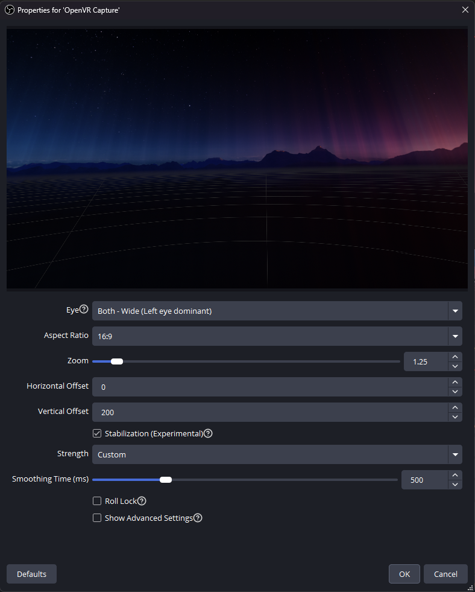

# OpenVR Capture for OBS Studio

This plugin allows capturing directly from OpenVR/SteamVR in full resolution.

A fork of [Pigney/OpenVR-Capture](https://github.com/Pigney/OpenVR-Capture), itself a fork of OBS-OpenVR-Input-Plugin, originally made by Keijo "Kegetys" Ruotsalainen.

### Q. What benefits does this have over the original?
A.
- **Real-time image stabilization** — head-rotation smoothing done as a GPU reprojection pass, frame-rate agnostic: it pairs each mirror frame with the pose it was actually rendered with, at any headset refresh, any game frame rate, and any OBS canvas rate (see below).
- **Wide mode** — composites both eyes into a single wider-FOV view (Eye dropdown), with a dominant-eye blend seam kept off-center. Distant scenery merges cleanly; nearby objects may ghost at the seam.
- Crop function replaced with realtime Aspect Ratio dropdown with Zoom and Offsets.
- Threaded initialization prevents stutter in OBS Studio.
- OpenVR SDK updated from v1.12.5 to v2.5.1.
- Minor performance tweaks.

---------

### Image Stabilization

Smooths head rotation (yaw/pitch/roll) in real time by reprojecting the SteamVR mirror image against headset pose data — an async-timewarp-style GPU pass that replaces the plugin's texture copy.

Under the hood, a dedicated thread watches the SteamVR compositor's frame cadence and captures each mirror frame at a fixed point in its life, so the image is always warped against the pose it was actually rendered with. This works regardless of whether the game runs at the headset's full refresh or is being reprojected at half rate, and regardless of your OBS canvas frame rate — there is nothing to configure per game.

**Everyday controls:**
- Tick **Stabilization** in the source properties.
- **Strength** — Low / Medium / High presets, or Custom with a Smoothing Time slider (the time constant of the smoothed view; higher = steadier, trails deliberate turns more).
- **Roll Lock** — keeps the horizon gravity-level instead of following head tilt, so the viewer never sees the camera roll.
- Corrections hide inside the **Zoom** margin — set Zoom to ~1.2 or higher. At Zoom 1.0 stabilization still works but reveals black edges while correcting (the properties dialog shows a warning).

**Advanced** (behind *Show Advanced Settings* — the defaults are right for almost everyone):
- **Smoothing Filter** — *Damped Average* absorbs tremor equally at rest and in motion; *One Euro* adapts to head speed (much less trail on turns, lets more shake through during fast motion).
- **Positional Jitter Compensation** — counteracts small translational shake at an assumed scene depth (Reference Depth up to 100 m for distant scenery).
- **Mirror Lag (ms)** — the one hardware calibration, see below.
- **Calibration: Freeze View** — the calibration instrument.
- Debug logging and CSV telemetry for troubleshooting.

### Calibrating Mirror Lag

The plugin needs one number that nothing in the OpenVR API reports: how long after a frame is composited its pixels actually reach the mirror texture on *your* system. The default (8.5 ms, measured on a Quest 3 over Steam Link) is likely close for most setups. If stabilized footage looks slightly rubbery or shivers with head motion, calibrate it once:

1. **Show Advanced Settings** → tick **Calibration: Freeze View**. The view freezes to your current heading — from now on, *any* image motion is pairing error.
2. Shake the headset (worn, or in hand while watching the OBS preview).
3. Watch the OBS log (*Help → Log Files → View Current Log*): a line like `stab: calibration score 0.312 (lower = stiller)` prints every 2 seconds.
4. Sweep **Mirror Lag** in 0.5 ms steps until the score bottoms out (the image will visibly go still at the same point).
5. Untick **Freeze View**. Done — the one number covers every game, load, and refresh rate; the plugin derives the rest per frame.

---------

### Provenance, or: who wrote this

Everything this fork adds on top of [upstream](https://github.com/Pigney/OpenVR-Capture) — the stabilization engine, wide mode, the pairing model, all of it — was, in the maintainer's own words, **shamelessly vibecoded**: written by Claude (Anthropic's AI) across long measurement-and-debugging sessions, with the maintainer supplying the ideas, the VR legs, the telemetry, and the taste, and the AI supplying the C++.

It was developed against real captured timing data and adversarially reviewed by more AI before each release, then validated in-headset by a human — but no human has read every line. The maintainer explicitly takes no responsibility for this code. Claude, for its part, accepts authorship and the blame that comes with it: if it breaks, the robot wrote it. (Standard no-warranty terms apply either way — see LICENSE.)

Issues are welcome; bring a log file and, ideally, a telemetry CSV.

---------

Installation:
1. Download latest release .zip
2. Extract all files to the root of your OBS Studio installation.

---------

Compiling:
1. Pull OBS Studio source code recursively (`git clone https://github.com/obsproject/obs-studio.git --recursive`)
2. Pull this repo, copy "plugins" into the root of OBS Studio's source code
3. Pull OpenVR SDK **v2.5.1** inside "deps" folder. (`git clone --branch v2.5.1 --depth 1 https://github.com/ValveSoftware/openvr.git`) — newer SDK headers request runtime interface versions that older SteamVR installs don't provide, which makes VR_Init fail with "Interface Not Found (105)".
4. Add `add_obs_plugin(win-openvr PLATFORMS WINDOWS)` to the end of obs-studio/plugins/CMakeLists.txt
5. Compile from root directory with `cmake --preset windows-x64 && cmake --build ./build_x64/plugins/win-openvr --config Release`
